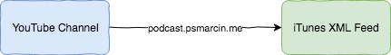

### YoutubeGoesPodcast

It's simple service that provide you feed from youtube channel (in future I'm going to support playlist and users). 

Produced feed should help you follow new "videos" in your podcast app. 

There are so many great videos on youtube that works perfect without video, and you only want to listen audio part while doing other things. 

### TODO

* [ ] PoC for video https://github.com/psmarcin/youtubeGoesPodcast/issues/10
* [ ] PoC for audio https://github.com/psmarcin/youtubeGoesPodcast/issues/11
* [ ] Fix podcasts feed to support all fields https://github.com/psmarcin/youtubeGoesPodcast/issues/12
* [ ] Tests https://github.com/psmarcin/youtubeGoesPodcast/issues/13
* [ ] Startup scripts https://github.com/psmarcin/youtubeGoesPodcast/issues/14
* [x] CI & CD https://github.com/psmarcin/youtubeGoesPodcast/pull/6
* [x] Readme https://github.com/psmarcin/youtubeGoesPodcast/pull/8

### Development

Please keep in mind that this is my side project. I want to learn Go language providing API. 

#### Setup 
There are no additional dependency except `go`. 

First please put env variable that you can find in `now.js` into `.env` file and then just run `go run main.go` and you are good to go. 
